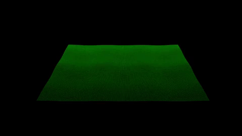

# 2d Function Grapher

This application allows the user to graph time-varying [patches](https://en.wikipedia.org/wiki/Topological_manifold#Coordinate_charts) in ℝ<sup>3</sup>, as well as visualize the [gaussian curvature](https://en.wikipedia.org/wiki/Gaussian_curvature) and [mean curvature](https://en.wikipedia.org/wiki/Mean_curvature) on every point of the patch over time, in real-time.


A "time-varying patch in ℝ<sup>3</sup>" is a function IxU-\>ℝ<sup>3</sup>, where I⊂ ℝ and U⊂ℝ<sup>2</sup>.

# Features
* Dynamic generation of CUDA kernels for fast computation
* Real-time (over 150 fps) rendering of dymanic patches
* Real-time (over 150 fps) computation of gaussian and mean curvature
* Rendering of user-defined functions over user-defined domains



# Installation
1. Install [my python game engine](https://github.com/walley892/engine)
2. Install [CUDA](https://docs.nvidia.com/cuda/cuda-installation-guide-linux/index.html) on your system
3. 
```
git clone https://github.com/walley892/shapes
cd shapes
// possibly inside of a virtual environment if that's your thing
pip3 install -r requrements.txt
python3 shapes-application.py
```

# Built on
* Python3
* CUDA
* OpenGL ([custom game engine](https://github.com/walley892/engine))
* Starbucks :)
